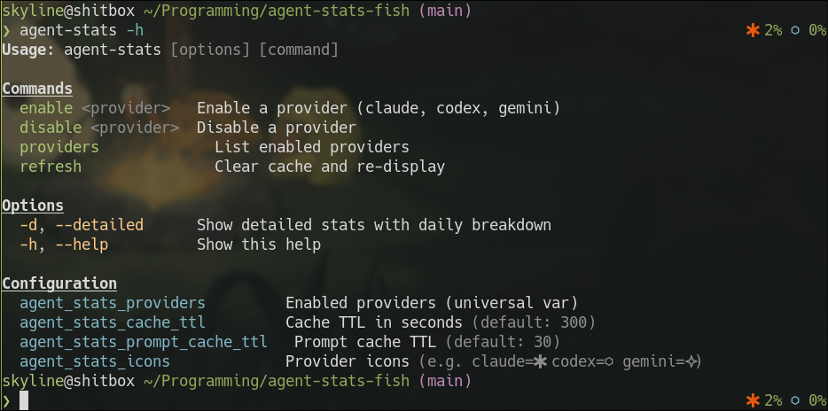

# agent-stats

A [Fish shell](https://fishshell.com) plugin that displays usage statistics for AI coding agents. Tracks Claude Code, OpenAI Codex, and Google Gemini CLI in your terminal -- as a right-prompt indicator, a compact summary, or a detailed daily breakdown.



## Features

- **Right-prompt integration** -- live usage stats in your prompt (rate limit %, token counts)
- **Three display modes** -- prompt (minimal), compact (one-line), and detailed (full breakdown)
- **Multi-provider** -- enable any combination of Claude, Codex, and Gemini
- **Background caching** -- non-blocking data refresh with configurable TTL
- **Color-coded usage** -- green/yellow/red thresholds for rate limits

## Requirements

- [Fish shell](https://fishshell.com) 3.1+
- [jq](https://jqlang.github.io/jq/) (JSON processor)
- [Fisher](https://github.com/jorgebucaran/fisher) (plugin manager)

## Installation

```fish
fisher install skyline69/agent-stats-fish
```

Or install from a local clone:

```fish
fisher install .
```

## Quick Start

Enable the providers you use:

```fish
agent-stats enable claude
agent-stats enable codex
agent-stats enable gemini
```

Then run `agent-stats` for a compact summary, or `agent-stats -d` for a detailed breakdown.

The right prompt updates automatically with live stats for all enabled providers.

## Usage

```
agent-stats                  # Compact stats for all enabled providers
agent-stats -d, --detailed   # Detailed stats with daily breakdown and model usage
agent-stats enable <provider> # Enable a provider (claude, codex, gemini)
agent-stats disable <provider> # Disable a provider
agent-stats providers        # List enabled providers
agent-stats refresh          # Clear cache and re-fetch
agent-stats -h, --help       # Show help
```

## Display Modes

### Right Prompt

A minimal indicator in your right prompt showing usage at a glance:

```
 7%  ⬡ 0%  󰫣 8.1K
```

- Claude and Codex show rate limit percentages (color-coded by severity)
- Gemini shows today's token count

### Compact

One line per provider with progress bars and key metrics:

```
Claude (Max) ██░░░░░░░░ 7%/5h
Codex (Premium) ░░░░░░░░░░ 0%/5h
Gemini: 8.1K tokens | 3 msg
```

### Detailed (`-d`)

Full breakdown including:

- Rate limit bars with reset countdowns
- 7-day daily activity table (messages, sessions, tokens)
- Per-model token/turn breakdown
- All-time totals

## Configuration

All settings are Fish universal variables that persist across sessions.

| Variable | Default | Description |
|---|---|---|
| `agent_stats_providers` | *(empty)* | Enabled providers (managed by enable/disable) |
| `agent_stats_cache_ttl` | `300` | Cache lifetime in seconds for compact/detailed modes |
| `agent_stats_prompt_cache_ttl` | `30` | Cache lifetime in seconds for right-prompt |
| `agent_stats_icons` | `claude= codex=⬡ gemini=󰫣` | Per-provider icons (Nerd Font glyphs) |

### Customizing Icons

```fish
set -U agent_stats_icons claude=C codex=X gemini=G
```

Icons use [Nerd Font](https://www.nerdfonts.com/) glyphs by default. Override with any character or string.

### Starship Integration

If you use [Starship](https://starship.rs), it defines its own `fish_right_prompt` which overrides the built-in one from this plugin. To display agent-stats in your Starship prompt, add a custom module to `~/.config/starship.toml`:

```toml
[custom.agent_stats]
command = "fish -c '__agent_stats_prompt'"
when = "fish -c 'test (count $agent_stats_providers) -gt 0'"
format = "$output"
shell = ["bash"]
```

This calls the same `__agent_stats_prompt` function used by the built-in right prompt, so all formatting, icons, and color coding work identically. The `format = "$output"` setting passes through ANSI colors without Starship's default style wrapping.

Then add `${custom.agent_stats}` wherever you want it in your `format` or `right_format`:

```toml
right_format = """$custom"""
```

The `agent-stats` and `agent-stats -d` commands work normally regardless of prompt framework.

### Adjusting Cache TTL

```fish
set -U agent_stats_cache_ttl 600       # 10 minutes for main display
set -U agent_stats_prompt_cache_ttl 15  # 15 seconds for right prompt
```

## Data Sources

The plugin reads local data written by each agent -- no API keys or authentication needed (except Claude's optional OAuth fallback).

| Provider | Location |
|---|---|
| Claude | `~/.claude/plugins/claude-hud/.usage-cache.json`, `~/.claude/projects/` |
| Codex | `~/.codex/sessions/`, `~/.codex/history.jsonl` |
| Gemini | `~/.gemini/tmp/session-*.json`, `~/.gemini/tmp/*/logs.json` |

## License

MIT
